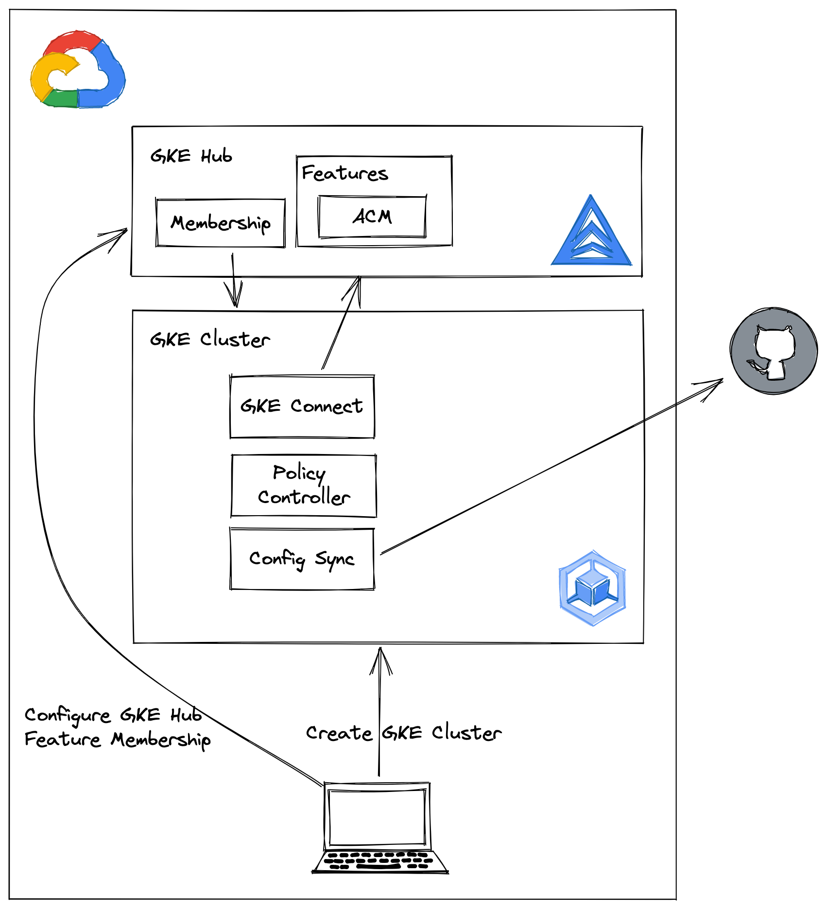

# gke-acm-bootstrap

## TL;DR

This is a pattern to bootstrap GKE clusters to with components and configuration using GKE Hub and Config Sync as part of cluster provisioning.

## Abstract

Once GKE clusters are created by our provisioner of choice, subsequent post-install steps or bootstrapping processes are required to orchestrate the deployment of cluster configuration, addons and applications.

These bootstrapping steps occur after a cluster has been provisioned, requiring some entity to access to the API Server to deploy these components (ie. via `kubectl`, Helm).

Consequently, this 'push' operation to the newly provisioned cluster often is how the initial components are deployed, before any level of hardening, configuration or security controls have been initialised.

What this pattern encourages is for cluster initialisation to be part of the provisioning process using components that are first-class citizens in GCP and GKE, thus are configured via GCP APIs not the Kubernetes API Server.

## Design

## [Provisioners](./provisioners/)

- [gcloud](./provisioners/gcloud/)
- [terraform](./provisioners/terraform/)
- [config-connector](./provisioners/config-connector/)
- [pulumi](./provisioners/pulumi/)

## Multi-cloud

### Anthos Attached Clusters

## References

<https://cloud.google.com/anthos-config-management/docs/how-to/installing-config-sync>
<https://cloud.google.com/anthos-config-management/docs/concepts/configs>
<https://cloud.google.com/blog/topics/developers-practitioners/running-anthos-inside-google>
<https://github.com/GoogleCloudPlatform/anthos-config-management-samples>
